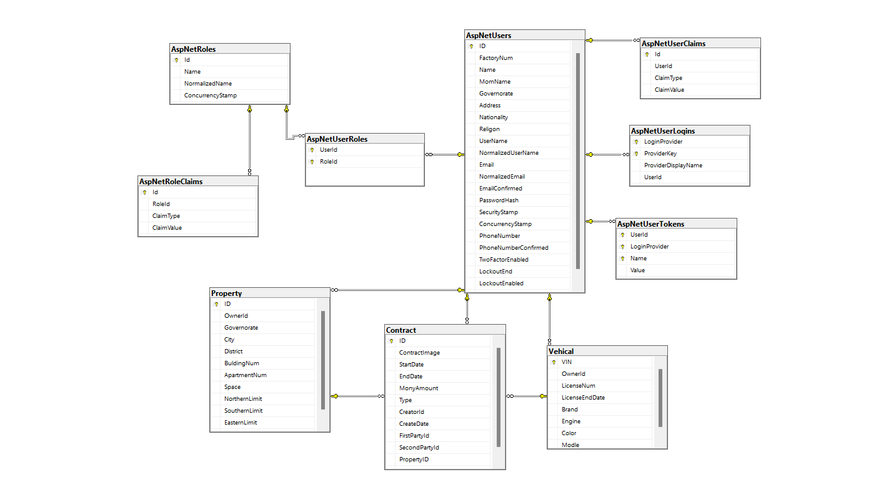
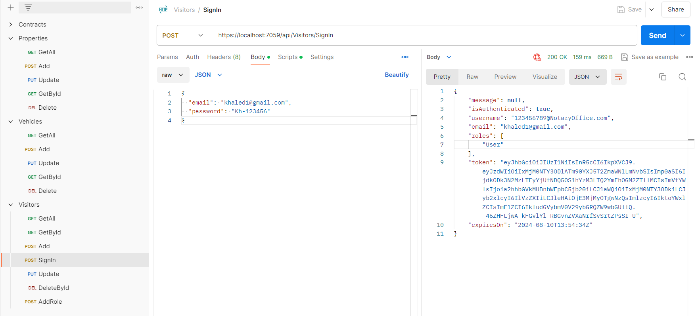

# Notary-Office
 A website for the notary office based on artificial intelligence to automate and  document the processes of buying and selling citizens' property that used to  take a long time to complete.  My responsibility was to create the data base using SQL Server and the backend  using .NET Core.

